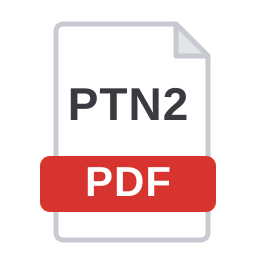

<div align="center">
  
  <h1>PTN2PDF</h1>
  <p><strong>Fusionnez, convertissez et nettoyez vos PDF. Tout reste sur votre machine, aucun fichier n'est envoyé nulle part.</strong></p>
</div>

---

PTN2PDF est un outil de manipulation de PDF **100 % local**. Aucun serveur distant, aucun envoi de fichier : tout le traitement se fait dans votre navigateur (ou dans l'application de bureau). Idéal pour assembler, convertir et nettoyer des documents sans les confier à un service en ligne.

## Fonctionnalités

### Composer le document
- **Import multiple** : glissez-déposez des **PDF** et des **images** (PNG, JPEG, WebP), ou parcourez vos fichiers.
- **Images → PDF** : chaque image importée devient une page réordonnable.
- **Vignettes de toutes les pages**, rendues via pdf.js.
- **Réorganisation par glisser-déposer**.
- **Rotation, suppression, duplication**, à l'unité ou par sélection.
- **Insertion de pages blanches** (A4 ou Lettre, portrait ou paysage).
- **Sélection multiple** : cases, clic + Shift (plage), clic + Ctrl (ajout), lasso, « Tout sélectionner » et « Inverser ».
- **Annuler / Rétablir** (`Ctrl+Z` / `Ctrl+Y`) sur toutes les opérations.
- **Zoom des vignettes** réglable, **aperçu grand format** navigable (flèches précédent/suivant).
- **Code couleur par document source**.

### Exporter
- **Fusionner** toutes les pages en un seul PDF, ou **extraire uniquement la sélection**.
- **Découper** : un PDF par document source, le tout dans une archive ZIP.
- **PDF → images** : exporter les pages en PNG ou JPEG dans un ZIP (résolution réglable), ou une page seule en un clic.
- **Compresser** : rastérisation des pages en JPEG (résolution et qualité réglables) pour réduire le poids.
- **PDF cherchable (OCR)** : reconnaissance de texte **100 % locale** (moteur et données de langue embarqués, aucun accès réseau) qui ajoute une couche de texte sélectionnable sous chaque page.
- **Finitions** : numérotation des pages, filigrane, édition des métadonnées (titre, auteur).

### Confort
- **Langues** : interface en **français** et **anglais**, détectée automatiquement selon la langue du système (modifiable via le sélecteur en haut à droite).
- **Persistance de session** : votre travail est conservé automatiquement en local (IndexedDB) et restauré à la réouverture. Rien ne quitte l'appareil.
- **Raccourcis clavier** : `Suppr` (supprimer la sélection), `Ctrl+A` (tout sélectionner), `Ctrl+Z`/`Ctrl+Y` (annuler/rétablir), `Échap` (fermer/désélectionner), flèches (naviguer dans l'aperçu).

## Utilisation

### Option 1 : version portable (Windows)

Téléchargez le `.exe` depuis la page [Releases](https://github.com/MrGautier256/PTN2PDF/releases), puis lancez-le. Aucune installation requise.

### Option 2 : dans le navigateur

Un petit serveur statique PowerShell est fourni (nécessaire car l'app utilise des modules ES).

```bat
start.bat
```

Le script démarre le serveur puis ouvre `http://localhost:5500` dans votre navigateur.

### Option 3 : application de bureau (développement)

```bash
npm install
npm run electron:start
```

## Compiler l'exécutable

```bash
npm run dist
```

Ou double-cliquez sur `build.bat`. L'exécutable portable est généré dans le dossier `release/`.

## Pile technique

| Rôle | Outil |
| --- | --- |
| Rendu des pages PDF | [pdf.js](https://mozilla.github.io/pdf.js/) |
| Manipulation / export PDF | [pdf-lib](https://pdf-lib.js.org/) |
| Archives ZIP | [JSZip](https://stuk.github.io/jszip/) |
| OCR (hors ligne) | [Tesseract.js](https://tesseract.projectnaptha.com/) |
| Glisser-déposer | [SortableJS](https://sortablejs.github.io/Sortable/) |
| Application de bureau | [Electron](https://www.electronjs.org/) + [electron-builder](https://www.electron.build/) |
| Interface | HTML, CSS et JavaScript natif (modules ES), sans framework |

Les bibliothèques front-end sont vendorisées dans `vendor/` pour un fonctionnement 100 % hors ligne.

## Structure du projet

```
PTN2PDF/
├── index.html            # Interface
├── css/style.css         # Styles (thème clair / sombre automatique)
├── js/
│   ├── app.js            # État, interface et orchestration
│   ├── pdf-utils.js      # Rendu pdf.js et images
│   ├── export.js         # Exports (fusion, découpe, compression, images, OCR, finitions)
│   ├── persistence.js    # Sauvegarde de session locale (IndexedDB)
│   └── i18n.js           # Traductions (fr/en) et détection de langue
├── vendor/               # Bibliothèques (pdf.js, pdf-lib, JSZip, SortableJS)
│   └── tesseract/        # Moteur OCR et données de langue (fra, eng) embarqués
├── assets/               # Icônes
├── electron/main.js      # Application de bureau Electron
├── serve.ps1             # Serveur statique local (PowerShell)
├── start.bat             # Lance le serveur + le navigateur
└── build.bat             # Génère l'exécutable portable
```

## Confidentialité

Aucune donnée ne quitte votre appareil. Les PDF sont lus, traités et réexportés localement, que ce soit dans le navigateur ou dans l'application Electron (qui sert les fichiers depuis un serveur local `127.0.0.1`). Même l'OCR fonctionne hors ligne : le moteur et les données de langue sont embarqués dans `vendor/tesseract/`, aucun téléchargement ni CDN.

## Licence

ISC
